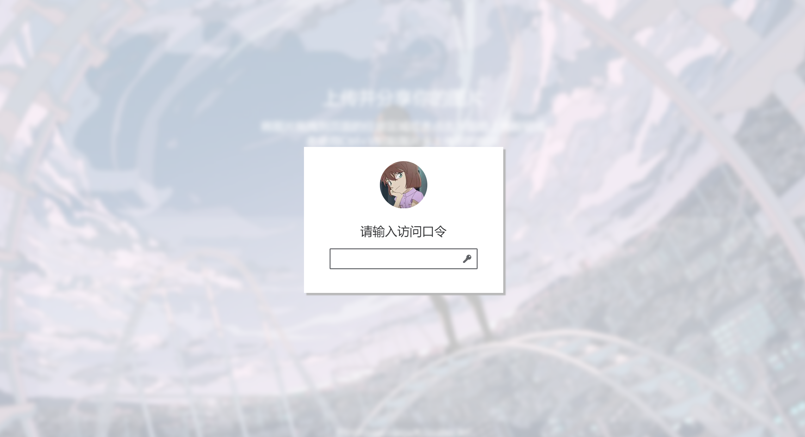

## 安装说明

基于Cloudflare R2对象存储和Workers的免费图床程序，安装前请确认自己已经拥有Cloudflare账号和已经开通Cloudflare R2对象存储功能。

功能特性
- 支持密码
- 支持拖拽、文件选取、直接粘贴三种上传方式
- 完全基于Cloudflare，零成本搭建

<table>
    <tr>
        <td>
            
        </td>
        <td>
            
        </td>
    </tr>
</table>


安装环境其他依赖
- nodejs > v16.13.0


1. 克隆仓库

```
git clone https://github.com/lixiaofei123/image-hosting-cfworkers.git
```

2. 进入到目录

```
cd image-hosting-cfworkers
```

3. 安装依赖

```
npm install
```

4. 创建R2存储桶


```
node_modules/wrangler/bin/wrangler.js  r2 bucket create mybucket  # mybucket 换成自己想要的存储桶名字
```

这一步中间可能会要求进行授权，具体是要求打开一个网页，然后在网页上进行授权流程。如果你使用本地的电脑直接进行的本安装步骤的话，那么这一步应该不会有什么问题。如果你是远程连接到某台服务器上安装的话，需要根据下面步骤进行操作。 a. 复制授权的url，在本地浏览器上打开，进行授权等流程。 b 授权完毕后，浏览器最终跳转到一个http://localhost:8976/oauth/callback/xxxx地址()，此时浏览器上显示无法访问。 c 复制浏览器上无法访问的地址，在终端软件上另外打开一个远程服务器新的会话，直接执行 curl "{替换成复制的地址}"，即可完成授权流程。 请注意，整个命令执行超时时间，如果显示超时失败，重新尝试即可


5. 编辑wrangler.toml配置文件

修改下面几个参数
 
 a. bucket_name = "myimages" 将其设置为第4步中创建的存储桶的名字
 b. R2_DOMAIN = ""  如果你想让图床直接返回R2对象存储的公开地址，可以设置这个R2_DOMAIN的值（需要在Cloudflare的R2对象存储中设置公开访问）。如果不设置，返回的地址是Workers代理后的地址。如果设置R2_DOMAIN，请注意CF R2的B类操作的免费额度为每月1000万次，超出就会扣费，每次访问图片都会消耗一次额度。Workers代理R2虽然也会产生B类操作，但是Workers一方面会使用缓存，另外一方面Workers的免费额度远小于B类操作的免费额度，且超出后只会暂停服务不会继续扣费。
 c. PASSWORD = "" 如果不设置，则允许匿名上传。（建议设置，Cloudflare提供的免费额度有限，自己使用即可）
 d. SIGN_KEY = "" 如果设置了PASSWORD，这个也需要设置，随便填写一串足够复杂的字符串即可

6. 页面个性化(可选)

编辑 src/index.html，在第7行修改网页的标题，在第10行修改图床的背景图，在第11行修改登录框的头像，在第14行修改qrcode.min.js资源的地址。默认的资源地址都是来自我自用的图床，可以直接使用，但不保证一直有效。可以直接把相关的资源在Cloudflare的R2控制台上传完毕后，然后在这里用图床的地址进行引用。地址的格式为 {图床域名}/file/{资源路径}


7. 部署

```
node_modules/wrangler/bin/wrangler.js deploy
```

部署完毕后，即可以访问。由于CF Workers提供的默认域名在国内可能无法访问，建议在CF Workers的后台绑定自己的域名（在CF Workers的 设置 -> 触发器）。

8. 打开地址访问


## API接口

下面的（需鉴权）指的是在设置密码的情况下，授权方式有下面两种
    
    1. Basic Auth 这种方式下，需要将 "admin:{密码}"用Base64密码编码后，通过Header或者Cookies将 Authentication: Basic {编码字符串} 传递给服务
    
    例如 Authentication: Basic xxxxxxxxxxxxxxxxxxxxxxxx
    
    2. Bearer Auth 这种方式下，需要先调用登录接口接口，登录接口会返回一个包含token的字符串，通过Header或者Cookies将 Authentication: Bearer {token} 传递给服务

    例如 Authentication: Bearer xxxxxxxxxxxxxxxxxxxxxxxx


### 鉴权接口（需鉴权）

    POST /auth/check 

    返回的状态码如果是200代表鉴权成功，否则就是鉴权失败

### 登录接口

    POST /auth/login

    参数: 

    ```
        {
            "password": "123456"
        }
    ```

    登录成功返回

    ```
        {
            "token": "xxxxxx"
        }
    ```
    失败返回其它内容

### 上传接口（需鉴权）

    PUT /file/{key}

    body为要上传的文件，上传成功返回

    ```
        {
            "url": "文件访问链接"
        }
    ```

    注意，同名的{key}会被覆盖，上传接口不检查文件的类型，即可以上传任何类型的文件

### 下载接口

    GET /file/{key}

### 删除接口（需鉴权）

    DELETE /file/{key}

### 远程获取接口（需鉴权）

    POST /fetchUrl/{资源URL}

    从提供的资源URL中获取数据并进行保存,上传成功返回

    ```
        {
            "url": "文件访问链接"
        }
    ```